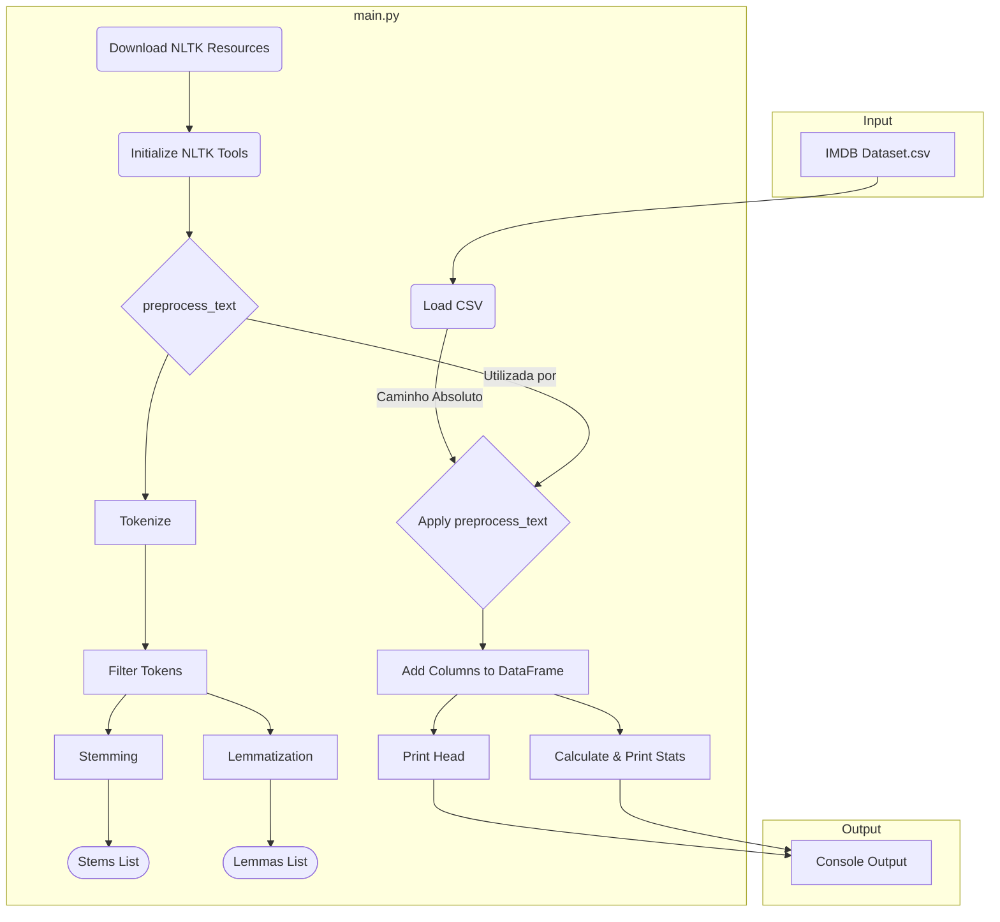

# Análise e Plano de Evolução: Análise de Sentimentos em Reviews de Filmes

Este documento detalha a análise da arquitetura atual do projeto de análise de sentimentos e propõe um plano de evolução priorizado.

## 1. Análise da Arquitetura Atual

O projeto segue um fluxo linear simples, executado inteiramente dentro do script `main.py`.

**Fluxo:**

1.  **Entrada:** Carrega dados de `IMDB Dataset.csv` (atualmente com caminho absoluto).
2.  **Inicialização:** Baixa recursos NLTK e instancia ferramentas (Stemmer, Lemmatizer).
3.  **Pré-processamento:** Função `preprocess_text` realiza tokenização, filtragem, stemming e lematização.
4.  **Aplicação:** Aplica `preprocess_text` a cada review via `pandas.progress_apply`.
5.  **Saída:** Exibe o cabeçalho do DataFrame processado e estatísticas básicas no console.

**Diagrama da Arquitetura Atual (Mermaid):**



**Observações:**

*   Arquitetura funcional, mas monolítica.
*   Dependência de caminho absoluto prejudica portabilidade.
*   Análise de sentimentos ainda não implementada.

## 2. Pontos Fortes

1.  **Documentação Inicial Clara (README.md):** Boa introdução, objetivos, instalação e execução.
2.  **Uso de Bibliotecas Padrão:** NLTK e Pandas são escolhas adequadas.
3.  **Implementação de Pré-processamento Essencial:** Cobre etapas fundamentais (tokenização, stopwords, stemming, lematização).
4.  **Feedback Visual de Progresso:** Uso de `tqdm` melhora a experiência do usuário.
5.  **Geração Comparativa:** Calcula stems e lemmas, facilitando a comparação.
6.  **Estrutura Lógica Sequencial:** Código em `main.py` segue uma ordem clara.

## 3. Oportunidades de Melhoria

1.  **Portabilidade (Caminho Absoluto):** Usar caminho relativo para o dataset.
2.  **Modularidade e Organização:** Separar código em módulos (`src/`).
3.  **Implementação da Análise de Sentimentos:** Adicionar a lógica de classificação.
4.  **Robustez (Tratamento de Erros):** Adicionar `try...except` para `FileNotFoundError`, etc.
5.  **Qualidade e Manutenção (Testes Unitários):** Implementar testes com `pytest`.
6.  **Flexibilidade (Configuração):** Usar `argparse` ou arquivo de configuração.
7.  **Reprodutibilidade (Dependências):** Gerar `requirements.txt`.
8.  **Desempenho (Otimização):** Considerar paralelização para datasets maiores.
9.  **Funcionalidades Faltantes:** Implementar visualização e relatórios.

## 4. Plano de Evolução Priorizado

**Fase 1: Fundamentos e Correções Essenciais (Prioridade: Alta)**
*   **Objetivo:** Tornar o projeto executável, portável e minimamente robusto.
*   **Passos:**
    1.  Corrigir Caminho do Dataset (usar caminho relativo).
    2.  Gerar `requirements.txt`.
    3.  Adicionar Tratamento Básico de Erros (`FileNotFoundError`).

**Fase 2: Modularização e Testabilidade (Prioridade: Média-Alta)**
*   **Objetivo:** Melhorar a organização, manutenção e introduzir garantia de qualidade.
*   **Passos:**
    1.  Refatorar em Módulos (`src/preprocessing.py`, `src/data_loader.py`).
    2.  Implementar Testes Unitários (`pytest` para `preprocess_text`).

**Fase 3: Implementação da Análise de Sentimentos (Prioridade: Alta)**
*   **Objetivo:** Implementar a funcionalidade central.
*   **Passos:**
    1.  Preparação dos Dados (Labels, Train/Test Split).
    2.  Extração de Features (TF-IDF/BoW).
    3.  Treinamento do Modelo (Naive Bayes, Logistic Regression, etc.).
    4.  Avaliação (Acurácia, Precisão, Recall, F1).
    5.  Integração no fluxo principal ou novo módulo.

**Fase 4: Melhorias e Funcionalidades Adicionais (Prioridade: Média-Baixa)**
*   **Objetivo:** Refinar o projeto e adicionar funcionalidades secundárias.
*   **Passos:**
    1.  Configuração Externa (`argparse` ou arquivo de config).
    2.  Visualizações (`matplotlib`/`seaborn`).
    3.  Geração de Relatórios (PDF/Markdown).
    4.  Otimização de Desempenho (se necessário).
    5.  Suporte Multilíngue (refatoração).

**Diagrama do Plano (Visão Geral das Fases):**

```mermaid
graph TD
    subgraph Fase 1 [Fundamentos]
        F1_1(Corrigir Path) --> F1_2(requirements.txt);
        F1_2 --> F1_3(Tratar Erros);
    end

    subgraph Fase 2 [Estrutura]
        F2_1(Modularizar) --> F2_2(Testes Unitários);
    end

    subgraph Fase 3 [Core]
        F3_1(Preparar Dados) --> F3_2(Extrair Features);
        F3_2 --> F3_3(Treinar Modelo);
        F3_3 --> F3_4(Avaliar Modelo);
        F3_4 --> F3_5(Integrar);
    end

    subgraph Fase 4 [Extras]
        F4_1(Configuração)
        F4_2(Visualização)
        F4_3(Relatórios)
        F4_4(Otimização)
    end

    F1_3 --> F2_1;
    F2_2 --> F3_1;
    F3_5 --> F4_1;
    F3_5 --> F4_2;
    F3_5 --> F4_3;
    F3_5 --> F4_4;

    style Fase1 fill:#f9f,stroke:#333,stroke-width:2px
    style Fase2 fill:#ccf,stroke:#333,stroke-width:2px
    style Fase3 fill:#f96,stroke:#333,stroke-width:2px
    style Fase4 fill:#9cf,stroke:#333,stroke-width:2px